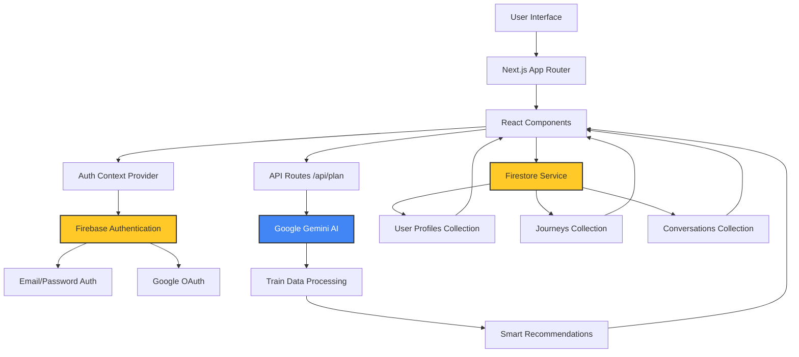

# trAI - AI-Powered Train Journey Planner

**trAI** is an intelligent train journey planning application for Indian Railways that leverages Google Gemini AI to provide personalized train recommendations. The app helps travelers find the best train options based on their preferences, whether they prioritize speed, cost, comfort, or reliability, and intelligently suggests connecting routes when direct options aren't available.

## Live Demo

**Visit the live application:** [https://tr-ai-phi.vercel.app/](https://tr-ai-phi.vercel.app/)

---

## Tech Stack

### Frontend
- **Next.js 16.1.6** - React framework with App Router
- **React 19.2.3** - UI library
- **Tailwind CSS 4** - Utility-first CSS framework

### Backend
- **Next.js API Routes** - Serverless API endpoints

### Database & Services
- **Firebase Authentication** - User authentication (Email/Password & Google OAuth)
- **Cloud Firestore** - NoSQL database for storing user journeys and profiles
- **Firebase Storage** - Cloud storage for user data

### AI Integration
- **Google Gemini API** (gemma-3-27b-it model) - Natural language processing for intelligent train recommendations

### State Management
- **React Context API** - Global state management for authentication

### Deployment
- **Vercel** - Cloud platform for deployment and hosting

### Development Tools
- **ESLint** - Code linting
- **PostCSS** - CSS processing
- **React Compiler** - Optimizing React builds

---

## Setup Instructions

### Prerequisites

- **Node.js** 18.x or higher (tested on v24.13.0)
- **npm** 9.x or higher (tested on v11.6.2)
- **Firebase Account** ([console.firebase.google.com](https://console.firebase.google.com/))
- **Google AI Studio Account** ([aistudio.google.com](https://aistudio.google.com/))

### 1. Clone the Repository

```bash
git clone https://github.com/Nivas-M/trAI.git
cd trAI
```

### 2. Install Dependencies

```bash
npm install
```

### 3. Set Up Firebase

1. Create a new Firebase project at [Firebase Console](https://console.firebase.google.com/)
2. Enable **Authentication** with Email/Password and Google providers
3. Create a **Firestore Database** (start in production mode)
4. Set up the following Firestore collections:
   - `users` - User profiles
   - `journeys` - Saved train journeys
   - `conversations` - Chat history (optional)
5. Copy your Firebase configuration credentials

### 4. Set Up Google Gemini API

1. Visit [Google AI Studio](https://aistudio.google.com/app/apikey)
2. Create a new API key for Gemini
3. Save the API key securely

### 5. Configure Environment Variables

Create a `.env.local` file in the root directory:

```bash
cp .env.example .env.local
```

Edit `.env.local` and add your actual credentials:

```env
# Firebase Configuration
NEXT_PUBLIC_FIREBASE_API_KEY=your_firebase_api_key_here
NEXT_PUBLIC_FIREBASE_AUTH_DOMAIN=your_project_id.firebaseapp.com
NEXT_PUBLIC_FIREBASE_PROJECT_ID=your_project_id
NEXT_PUBLIC_FIREBASE_STORAGE_BUCKET=your_project_id.appspot.com
NEXT_PUBLIC_FIREBASE_MESSAGING_SENDER_ID=your_messaging_sender_id
NEXT_PUBLIC_FIREBASE_APP_ID=your_firebase_app_id

# Google Gemini API Key
GEMINI_API_KEY=your_gemini_api_key_here
```

### 6. Run Development Server

```bash
npm run dev
```

Open [http://localhost:3000](http://localhost:3000) in your browser.

### 7. Build for Production

```bash
npm run build
npm start
```

---

## High-Level Architecture



### Architecture Description

**Frontend Layer:**
- Next.js components handle UI rendering and user interactions
- React Context API manages authentication state globally
- Protected routes ensure secure access to dashboard features
- Responsive design adapts to mobile and desktop screens

**State Management Layer:**
- `AuthContext` provides user authentication state
- Real-time state updates on auth changes
- Session persistence across page refreshes

**API Routes Layer:**
- `/api/plan` - Processes journey queries and returns AI-ranked results
- Serverless functions handle business logic
- Error handling for rate limits and API failures

**Firebase Integration:**
- **Authentication**: Manages user login/signup via email or Google
- **Firestore**: Stores user profiles, saved journeys, and conversation history
- **Security**: Firebase rules protect user data

**Gemini AI Integration:**
- Processes natural language queries (e.g., "Chennai to Bangalore tomorrow")
- Ranks trains based on user preferences (speed, cost, reliability)
- Suggests connecting routes when direct trains unavailable
- Handles complex scenarios with multi-city layovers

**Data Flow:**
1. User enters journey query
2. Query sent to API route with conversation history
3. API route sends prompt to Gemini with train database
4. Gemini analyzes and ranks options
5. Results returned to frontend with reasoning
6. User can save journeys to Firestore
7. Saved journeys appear in dashboard

---

## AI Usage Summary (Gemini Role)

### What AI Features Are Implemented

**trAI** leverages Google's Gemini AI (`gemma-3-27b-it` model) to transform train journey planning into an intelligent, conversational experience. The AI serves as the core decision-making engine of the application.

### How Gemini API Is Integrated

The Gemini API is integrated in the `/app/api/plan/route.js` serverless function:

1. **Model Configuration**:
   ```javascript
   const genAI = new GoogleGenerativeAI(process.env.GEMINI_API_KEY);
   const model = genAI.getGenerativeModel({
     model: "gemma-3-27b-it",
     generationConfig: {
       temperature: 0.7,
       topP: 0.95,
       topK: 40,
       maxOutputTokens: 2048,
     },
   });
   ```

2. **Prompt Engineering**: The system sends a structured prompt containing:
   - User's natural language query
   - Complete train database with routes, timings, prices, and comfort levels
   - Available connecting routes with layover information
   - Conversation history for context
   - Instructions for ranking and reasoning

3. **Response Processing**: 
   - JSON parsing with automatic repair for malformed responses
   - Error handling for rate limits and API failures
   - Fallback to unranked results if AI unavailable

### Specific Use Cases

**1. Natural Language Understanding**
- Interprets abbreviations: "blore" → Bangalore, "chn" → Chennai
- Handles misspellings: "banglore" → Bangalore
- Recognizes station codes: "MAS" → Chennai Central
- Understands local names: "Madras" → Chennai

**2. Intelligent Route Matching**
- Matches user queries to available direct routes
- Suggests connecting routes when no direct trains exist
- Combines multi-leg journeys with layover advice

**3. Smart Ranking & Recommendations**
- Ranks trains by speed, cost, comfort, or reliability
- Provides detailed reasoning for each recommendation
- Offers contextual notes (e.g., "Allow 4-6 hours layover at Bangalore")

**4. Conversational Refinement**
- Maintains conversation context across queries
- Allows follow-up requests like "show me cheaper options"
- Adapts recommendations based on user preferences

### Example AI-Powered Functionality

**User Query**: "I need to go from Chennai to Bangalore tomorrow, something fast"

**Gemini AI Response**:
```json
[
  {
    "train": "Shatabdi Express",
    "reason": "Fastest option at just 5 hours with high reliability",
    "notes": ["Departs from Chennai Central at 06:00", "Air-conditioned chair car comfort"]
  },
  {
    "train": "Brindavan Express",
    "reason": "Budget-friendly at ₹350 with decent speed (6.2 hours)",
    "notes": ["Morning departure", "Second seating class"]
  }
]
```

The AI ranks Shatabdi Express first because the user prioritized speed ("something fast").

### Benefits of AI Integration

- **Natural Language Processing**: Users can ask questions conversationally, no need for structured queries  
- **Context-Aware Recommendations**: AI understands implicit preferences and refines based on feedback  
- **Intelligent Route Planning**: Automatically suggests connecting routes with optimal layovers  
- **Personalized Results**: Rankings adapt to individual priorities (speed, cost, reliability)  
- **Graceful Degradation**: Falls back to full train list if AI temporarily unavailable  
- **Error Recovery**: Auto-repairs malformed JSON responses from AI  

---

## Features

- **User Authentication** - Secure login/signup with email or Google
- **AI-Powered Search** - Natural language train queries
- **Smart Recommendations** - AI ranks trains by your preferences
- **Connecting Routes** - Multi-leg journeys with layover suggestions
- **Save Journeys** - Bookmark favorite trips to your dashboard
- **Responsive Design** - Works seamlessly on mobile and desktop
- **Real-Time Results** - Instant search with loading states
- **Protected Routes** - Secure dashboard access for authenticated users
- **Dark Mode UI** - Modern, eye-friendly interface
- **Journey Details** - Comprehensive train info (timings, prices, comfort, reliability)

---

## Project Structure

```
trAI/
├── app/
│   ├── api/
│   │   └── plan/
│   │       └── route.js          # AI-powered journey planning API
│   ├── components/
│   │   ├── ProtectedRoute.js     # Route protection wrapper
│   │   └── resultCard.js         # Train result card UI
│   ├── context/
│   │   └── AuthContext.js        # Authentication context provider
│   ├── dashboard/
│   │   └── page.js               # Saved journeys dashboard
│   ├── login/
│   │   └── page.js               # Login/signup page
│   ├── globals.css               # Global styles
│   ├── layout.js                 # Root layout component
│   ├── page.js                   # Home page (search interface)
│   └── providers.js              # Context providers wrapper
├── lib/
│   ├── firebase.js               # Firebase initialization
│   └── firestore.js              # Firestore database operations
├── public/                       # Static assets
├── .env.example                  # Environment variables template
├── .gitignore                    # Git ignore rules
├── next.config.mjs               # Next.js configuration
├── package.json                  # Dependencies and scripts
├── postcss.config.mjs            # PostCSS configuration
└── tailwind.config.js            # Tailwind CSS configuration
```

---

## Environment Variables Reference

| Variable | Description | Required | Example |
|----------|-------------|----------|---------|
| `NEXT_PUBLIC_FIREBASE_API_KEY` | Firebase API key | Yes | `AIzaSyC...` |
| `NEXT_PUBLIC_FIREBASE_AUTH_DOMAIN` | Firebase auth domain | Yes | `project.firebaseapp.com` |
| `NEXT_PUBLIC_FIREBASE_PROJECT_ID` | Firebase project ID | Yes | `my-project` |
| `NEXT_PUBLIC_FIREBASE_STORAGE_BUCKET` | Firebase storage bucket | Yes | `project.appspot.com` |
| `NEXT_PUBLIC_FIREBASE_MESSAGING_SENDER_ID` | Firebase messaging sender ID | Yes | `123456789` |
| `NEXT_PUBLIC_FIREBASE_APP_ID` | Firebase app ID | Yes | `1:123:web:abc` |
| `GEMINI_API_KEY` | Google Gemini API key | Yes | `AIzaSyD...` |

**Note**: Variables prefixed with `NEXT_PUBLIC_` are exposed to the browser. Keep `GEMINI_API_KEY` private (no prefix).

---

## Available Scripts

```bash
# Run development server
npm run dev

# Build for production
npm run build

# Start production server
npm start

# Run ESLint
npm run lint
```

---

## Contributing

Contributions are welcome! If you'd like to improve trAI:

1. Fork the repository
2. Create a feature branch (`git checkout -b feature/amazing-feature`)
3. Commit your changes (`git commit -m 'Add amazing feature'`)
4. Push to the branch (`git push origin feature/amazing-feature`)
5. Open a Pull Request

---

## License

This project is created as a capstone project. All rights reserved.

---

## Author

**Nivas M**

- GitHub: [@Nivas-M](https://github.com/Nivas-M)
- Project Link: [https://github.com/Nivas-M/trAI](https://github.com/Nivas-M/trAI)

---

## Acknowledgments

- **Google Gemini AI** - For powering intelligent recommendations
- **Firebase** - For authentication and database services
- **Vercel** - For seamless deployment
- **Next.js** - For the amazing React framework
- **Indian Railways** - For inspiration

---

**Built with passion using AI-first principles**
